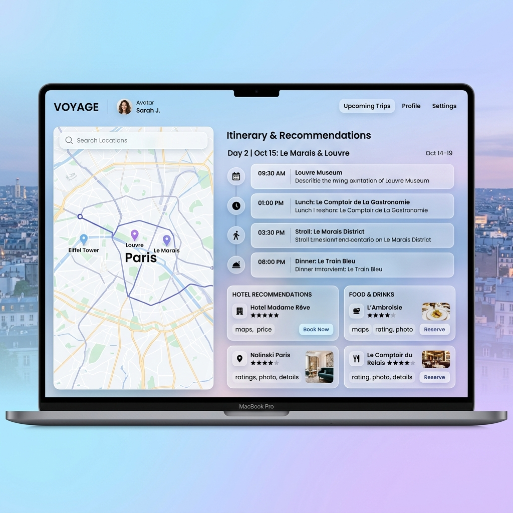

# 🌍 TripMate – Smart Travel Planning Platform

<p align="center">
  
</p>

<p align="center">
  <b>Smart • Modern • Interactive Travel Planning Web Application</b>
</p>

---

# 📖 Overview

**TripMate** is a modern travel planning and itinerary management platform designed to help users organize trips efficiently with an elegant and interactive user experience.

The application provides:

* Personalized travel itineraries
* Hotel recommendations
* Food & drinks suggestions
* Interactive travel dashboard
* Smooth animations and responsive design

TripMate focuses on combining **beautiful UI/UX** with practical travel planning functionality.

---

# ✨ Features

## 🗺️ Smart Travel Dashboard

* Interactive trip itinerary interface
* Organized timeline-based travel planning
* Clean and modern layout

## 🏨 Hotel Recommendations

* Recommended hotels with ratings
* Booking-ready UI components
* Travel-friendly suggestions
  
## 📱 Responsive Design

* Mobile-friendly UI
* Tablet and desktop optimized
* Smooth adaptive layouts

## 🎨 Modern UI Design

* Glassmorphism effects
* Gradient color palette
* Smooth hover animations
* Scroll reveal transitions

## ⚡ Interactive Experience

* Dynamic animations using JavaScript
* Mobile navigation toggle
* Responsive interactive components

---

# 📸 Screenshots

## 🏠 Dashboard Preview

<p align="center">
  
</p>


🗺️ Travel Itinerary Section

(Shows timeline and trip schedule)


🏨 Hotel Recommendations


📱 Mobile Responsive View

---

# 🛠️ Tech Stack

## Frontend

* HTML5
* CSS3
* JavaScript (Vanilla JS)

## Backend

* Node.js
* Express.js
* MongoDB
* Mongoose

## Authentication & Utilities

* JWT Authentication
* bcryptjs
* dotenv
* multer
* cors

---

# 📂 Project Structure

```bash
TripMate/
│
├── frontend/
│   ├── index.html
│   ├── styles.css
│   ├── script.js
│
├── backend/
│   ├── server.js
│   ├── routes/
│   ├── controllers/
│   ├── models/
│
├── screenshots/
│   └── app_dashboard.png
│
├── package.json
├── .gitignore
└── README.md
```

---

# 🚀 Installation & Setup

## 1️⃣ Clone the Repository

```bash
git clone https://github.com/your-username/tripmate.git
```

---

## 2️⃣ Navigate to Project Folder

```bash
cd tripmate
```

---

## 3️⃣ Install Dependencies

```bash
npm install
```

---

## 4️⃣ Run the Project

```bash
npm start
```

or

```bash
nodemon server.js
```

---

# 🎨 UI Highlights

* Glassmorphism design system
* Soft gradient background
* Interactive dashboard layout
* Elegant typography
* Smooth transitions & animations
* Clean responsive cards

---

# ⚙️ Core Functionalities

## 📍 Travel Itinerary Management

Users can organize travel plans day-wise with scheduled timelines.

## 🗺️ Destination Exploration

Interactive sections for discovering places and attractions.

## 🏨 Accommodation Suggestions

Hotel recommendations with modern booking UI.

## 🍴 Food Recommendations

Restaurants and food places displayed with ratings and details.

## 📱 Responsive User Interface

Fully optimized for:

* Desktop
* Tablet
* Mobile devices

---

# 🔥 Future Enhancements

* 🤖 AI-powered travel recommendations
* 🌦️ Real-time weather integration
* 📍 Google Maps API integration
* 🔐 User authentication system
* 💳 Online booking & payments
* 🧳 Trip sharing functionality
* ❤️ Wishlist & saved places
* 🌐 Multi-language support

---

# 💻 Dependencies

```json
{
  "bcryptjs": "^3.0.3",
  "cors": "^2.8.6",
  "dotenv": "^17.4.2",
  "express": "^5.2.1",
  "jsonwebtoken": "^9.0.3",
  "mongoose": "^9.4.1",
  "multer": "^2.1.1"
}
```

# 🌟 Project Vision

TripMate aims to make travel planning smarter, easier, and visually engaging by combining modern web technologies with user-centric design.

---

# ⭐ Support

If you like this project, give it a ⭐ on GitHub and support the project.

---

